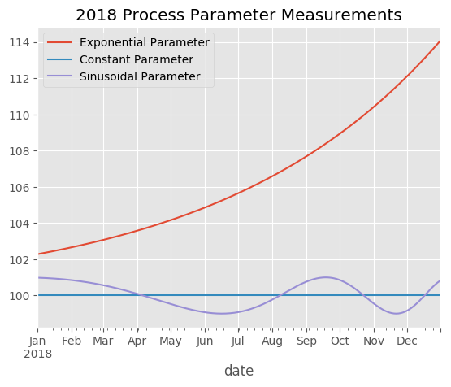

# sqlpandas

This proof-of-concept python script queries data from a Microsoft SQL Server database and generates data visualizations (plots). A Docker image is provided with all dependencies installed, including the [Microsoft ODBC Driver for SQL Server](https://www.microsoft.com/en-us/download/details.aspx?id=53339).

The approach outlined below queries an existing database using ordinary SQL queries, and creates a pandas DataFrame from the selection.

```python
query = "SELECT * FROM Process WHERE date >= '2018/01/01' AND date < '2019/01/01'"
process_data = pd.read_sql(query, engine)
```

 Because the data is held in-memory as a pandas DataFrame, the entire scientific python stack is available for analysis and visualization. Plots are generated using [matplotlib](https://matplotlib.org/).

 


## Getting Started

The easiest way to test out this script is by using Docker. The script can also be run within an existing python environment, with some dependencies.

### Run With Docker

Clone this repository and `cd` to it. The docker image can be built and run in one command:

```docker
docker-compose run --rm sqlpandas python proof_of_concept.py
```

To build the `sqlpandas` image without running it:

```docker
docker-compose build
```

Finally, to stop and remove the SQL Server container:

```docker
docker-compose down
```

### Standalone Usage
####  Prerequisites

+ Python 3.4 or newer
+ Pip/setuptools
+ [Microsoft ODBC Driver for SQL Server](https://www.microsoft.com/en-us/download/details.aspx?id=53339)
+ Access to a server running Microsoft SQL Server.

#### Installing

Download and install the ODBC driver according to Microsoft's instructions. Clone and `cd` to this repository. Install the python requirements:
```
pip install -r requirements.txt
```

At this point, the script can be used. If you do not want to set environment variables, the constants in [proof_of_concept](proof_of_concept.py):`createEngine()` can be set manually. If using Windows, the value for `DRIVER` may need to be changed to `r"{SQL Server}"``.

## Authors

Author | Contact | Github
--- | --- | ---
Andrew Hoetker | ahoetker@me.com | [ahoetker](https://github.com/ahoetker)

## License
MIT License

Copyright (c) [2019] [Andrew Hoetker]

Permission is hereby granted, free of charge, to any person obtaining a copy
of this software and associated documentation files (the "Software"), to deal
in the Software without restriction, including without limitation the rights
to use, copy, modify, merge, publish, distribute, sublicense, and/or sell
copies of the Software, and to permit persons to whom the Software is
furnished to do so, subject to the following conditions:

The above copyright notice and this permission notice shall be included in all
copies or substantial portions of the Software.

THE SOFTWARE IS PROVIDED "AS IS", WITHOUT WARRANTY OF ANY KIND, EXPRESS OR
IMPLIED, INCLUDING BUT NOT LIMITED TO THE WARRANTIES OF MERCHANTABILITY,
FITNESS FOR A PARTICULAR PURPOSE AND NONINFRINGEMENT. IN NO EVENT SHALL THE
AUTHORS OR COPYRIGHT HOLDERS BE LIABLE FOR ANY CLAIM, DAMAGES OR OTHER
LIABILITY, WHETHER IN AN ACTION OF CONTRACT, TORT OR OTHERWISE, ARISING FROM,
OUT OF OR IN CONNECTION WITH THE SOFTWARE OR THE USE OR OTHER DEALINGS IN THE
SOFTWARE.
